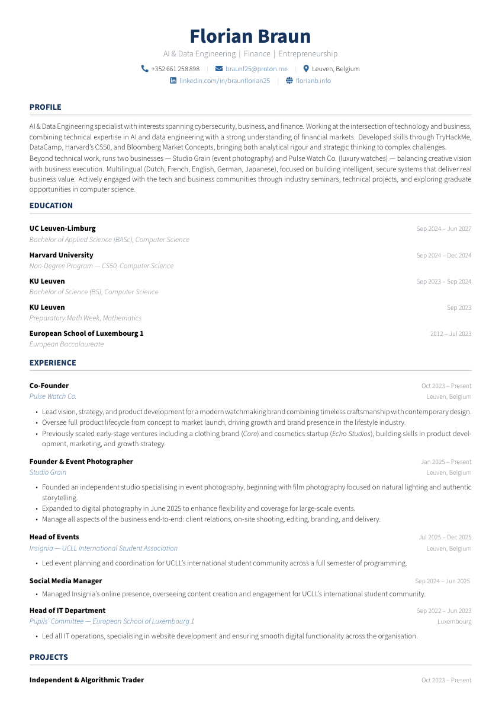

# LaTeX Resume

A modular, professionally designed LaTeX resume with a **Python GUI manager** for easy editing — no LaTeX knowledge required.

<p align="center">
  
</p>

## Features

- **Modular architecture** — content, styling, and macros are cleanly separated into individual files
- **GUI editor** — a tkinter-based Python app for adding, editing, and reordering resume entries
- **One-click PDF** — save and compile to PDF directly from the GUI
- **Easy theming** — change colors, fonts, and margins in a single config file
- **13 section types** — Header, Profile, Education, Experience, Projects, Organisations, Volunteering, Skills, Certifications, Courses, Honours & Awards, Languages, and sub-roles
- **Skill tags** — styled rounded badges rendered with TikZ
- **FontAwesome icons** — contact info uses FontAwesome 5 icons

## Project Structure

| File | Purpose |
|------|---------|
| `resume.tex` | Master document — loads packages and inputs the three files below |
| `resume-config.tex` | Colors, fonts, margins, section heading styles |
| `resume-commands.tex` | Reusable LaTeX macros (`\experience`, `\education`, `\project`, etc.) |
| `resume-content.tex` | **Your resume data** — the only file you edit for content changes |
| `resume-content.example.tex` | Example with placeholder data — copy to `resume-content.tex` to get started |
| `resume_manager.py` | Python GUI for editing entries and compiling the PDF |

## Prerequisites

- **TeX Live 2023+** (or MiKTeX) with these packages:
  `fontenc` `inputenc` `geometry` `xcolor` `hyperref` `titlesec` `enumitem` `tabularx` `multicol` `tikz` `fontawesome5` `sourcesanspro`
- **Python 3.10+** (for the GUI manager only — not needed to compile the PDF)
- `pdflatex` on your PATH

## Quick Start

### Option 1: Edit LaTeX directly

```bash
# Clone the repo
git clone https://github.com/YOUR_USERNAME/latex-resume.git
cd latex-resume

# Start from the example (or edit resume-content.tex directly)
cp resume-content.example.tex resume-content.tex

# Edit resume-content.tex with your information, then compile
pdflatex resume.tex && pdflatex resume.tex
```

> Run `pdflatex` twice so hyperlinks and cross-references resolve correctly.

### Option 2: Use the GUI Manager

```bash
python3 resume_manager.py
```

The GUI has three panels:

```
┌──────────┬──────────────────┬──────────────────────────┐
│ SECTIONS │  Entry List      │  Edit Form               │
│          │                  │                          │
│ Header   │  MIT             │  Institution: [________] │
│ Profile  │  UC Berkeley (*) │  Degree:      [________] │
│ Education│                  │  Date:        [________] │
│ Experienc│  [Add] [Delete]  │                          │
│ Projects │  [↑]   [↓]      │  Bullet points:          │
│ Skills   │                  │  [________________] [Add]│
│ ...      │                  │  [Save Entry]            │
├──────────┴──────────────────┴──────────────────────────┤
│ Status: Ready                   [Save & Compile PDF]   │
└────────────────────────────────────────────────────────┘
```

Click **Save & Compile PDF** to regenerate `resume-content.tex` and build a fresh PDF. A `.bak` backup is created before every save.

## Customization

### Colors

Edit the color palette in `resume-config.tex`:

| Color | Default | Usage |
|-------|---------|-------|
| `primary` | Dark navy `(20, 50, 90)` | Name, headings |
| `accent` | Steel blue `(42, 98, 154)` | Links, icons, organisation names |
| `subtle` | Warm grey `(108, 117, 125)` | Dates, secondary text |
| `divider` | Light grey `(200, 208, 216)` | Section rules |
| `tagbg` | Soft blue `(232, 240, 248)` | Skill tag background |
| `tagtext` | Deep blue `(30, 60, 110)` | Skill tag text |

### Fonts

The default font is **Source Sans Pro** (light weight). To change it, swap the font package in `resume-config.tex`:

```latex
% \usepackage[default,light]{sourcesanspro}  % current
\usepackage[default]{lato}                    % alternative
```

### PDF Metadata

Update the `pdfauthor` and `pdftitle` fields in `resume-config.tex` to match your name.

## Available Commands

All commands are defined in `resume-commands.tex`. Use them in `resume-content.tex`:

| Command | Arguments | Description |
|---------|-----------|-------------|
| `\makeheader` | `{Name}{Headline}{Contact Line 1}{Contact Line 2}` | Page header with name, headline, and contact info |
| `\contactitem` | `{\faIcon{icon}}{Text}` | Non-clickable contact item (phone, location) |
| `\contactlink` | `{\faIcon{icon}}{URL}{Label}` | Clickable contact link (email, website, LinkedIn) |
| `\contactsep` | — | Separator between contact items |
| `\education` | `{Institution}{Degree}{Date}` | Education entry |
| `\experience` | `{Title}{Organisation}{Date}{Location}` | Experience entry (follow with `\begin{bullets}`) |
| `\subrole` | `{Title}{Date}` | Additional role at the same organisation |
| `\project` | `{Title}{Date}` | Project entry (follow with `\begin{bullets}`) |
| `\organisation` | `{Organisation}{Role}{Date}{Association}` | Organisation membership |
| `\volunteer` | `{Role}{Organisation}{Date}{Category}` | Volunteering entry |
| `\skillcategory` | `{Category}{\skilltag{...}\skilltag{...}}` | Skill category with tags |
| `\skilltag` | `{Skill Name}` | Individual rounded skill badge |
| `\award` | `{Title}{Issuer}{Year}` | Honour or award |
| `\langentry` | `{Level}{Languages}` | Language proficiency entry |

### Bullet Lists

Use the `bullets` environment after `\experience`, `\project`, `\organisation`, or `\volunteer`:

```latex
\experience{Software Engineer}{Acme Corp}{2023 -- Present}{Remote}
\begin{bullets}
    \item Built a real-time data pipeline processing 1M+ events per day.
    \item Led migration from monolith to microservices architecture.
\end{bullets}
```

## License

MIT — see [LICENSE](LICENSE).
